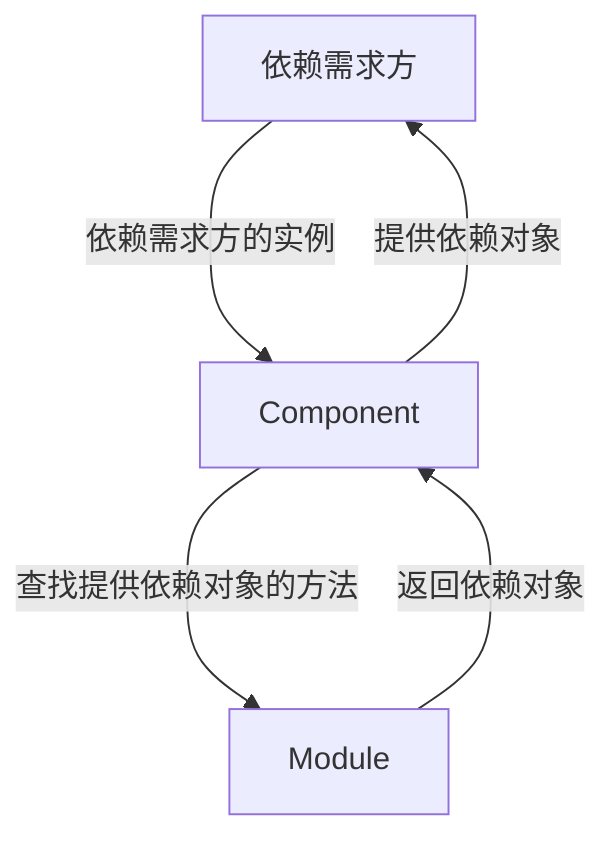

## 什么是Dragger2

- Dragger2是一种Android中热门的依赖注入框架，使用apt动态生成代码的方式来为依赖需求方注入依赖,实现了完全在编译阶段完成依赖注入。
  - emmm……上面的这句话反正我第一次看是“每个字都认识，但连起来就看不懂了”
  - 所以有必要先学一下什么是依赖注入

## 依赖注入

- 假设一个类的构造方法需要其他类的实例，比如

  ```Java
  public class BookStore {
      private Book book;
      public BookStore() {
          this.book = new Book();
      }
  }
  ```

- 这个时候会存在一个很明显的问题：当Book类的构造方法发生改变时，我们必须同时去改变BookStore中的代码

  - 解决这个问题其实很简单：在构造方法中传入参数`  public BookStore(Book book) {this.book = book;}`或者在利用`setBook()`方法或者利用接口提供`setter()`方法。
  - 但这些方法会存在代码臃肿、无法使用final、容易出现循环依赖等问题

- Dragger2这种框架就是通过一个外界实体类来向每一个需要的被提供依赖对象的类提供所需的依赖。

## Dragger2的结构介绍



1. 依赖需求方（可能是我们的任何一个Activity或者Java类）向component接口（依赖注入组件）说明自己所需求的依赖
2. component接口在Module库（依赖提供方）中查找是否有提供相应依赖对象的方法
3. 如果有，那么Moudle就向component返回相应的依赖对象，component再把这些对象提供给依赖需求方，保证依赖需求方实例创建成功

## Dragger2的简单Dome

- 假如一个人需要一双红鞋子，那么利用Dragger2的方法我们就需要首先创建一个鞋子类，然后通过Moudle接口提供红鞋子对象，再通过Component类把这个红鞋子提供给这个人

  - 鞋子类

    ```java
    public class Shoes{
        private String color;
        public String getColor() {
            return color;
        }
        public void setColor(String color) {
            this.color = color;
        }
        @Override
        public String toString() {
            return color + "布料";
        }
    }
    ```

  - Moudle类

    ```java
    @Module
    public class MyModule {
        @Provides
        public Shoes getShoes() {
            Shoes shoes = new Shoes();
            shoes.setColor("红色");
            return shoes;
        }
    }
    ```

    这里需要使用两个注解：@Module和@Provides

    - 注解@Module用来表明这个类是Moudle类，有这个注解的类才能被Component识别
    - 注解@Provides用来表明这个方法是用来提供依赖对象的，Component就是在那些有这个注解的方法中查找是否有提供所需依赖对象的

  - Component接口

    ```java
    @Component(modules=MyModule.class)
    public interface MyComponent {
        void inject(Person person);
    }
    ```

    这个类需要一个注解：@Component；需要提供inject()方法

    - @Component用来表明这个接口是Component接口，它的属性modules用来指明它能够调用的moudle库。
    - inject()方法用来指明它可以为哪些类提供依赖对象。

  - MyActivity类

    ```java
    public class Person{
        @Inject
        Shoes shoes;
        public static void main(String[] str){
            MyComponent build = DaggerMyComponent.builder().myModule(new MyModule()).build();
            build.inject(this);
        }
    }
    ```

    - 利用注解@Inject来表明这个对象是需要依赖的
    - 利用Dragger2自动生成的DaggerMyComponent来生成一个Component的实现类的对象，利用这个对象的inject方法来将自身传递给Component。

- 其他使用：

  - 可以给shoes类的构造方法直接加上@Inject，这样就可以不需要Moduel类来做中间商了，Component借口可以直接调用有@Inject的构造方法来生成依赖对象。

  - Moduel类中有@Provides注解的get方法可以调用其他有@Provides注解的get方法，比如：

    ```java
    @Module
    public class MyModule {
        @Provides
        public Shoes getShoes() {
            Shoes shoes = new Shoes();
            shoes.setColor("红色");
            return shoes;
        }
        @Provides
        public ShoesCabinet getShoeCabinet(Shoes shoes) {
            return shoesCabinet(Shoes shoes);
        }
    }
    ```

  - 注解@Named的使用：在使用@Provides的同时使用@Named来指明同一个类的不同对象，在使用@Inject的同时使用@Named来指明需要的是哪一个对象，比如：

    ```java
    @Module
    public class MyModule {
        @Provides
        @Named("red")
        public Shoes getShoes() {
            Shoes shoes = new Shoes();
            shoes.setColor("红色");
            return shoes;
        }
        @Provides
        @Named("blue")
        public Shoes getShoes() {
            Shoes shoes = new Shoes();
            shoes.setColor("蓝色");
            return shoes;
        }
    }
    ```

    ```java
    public class Person{
        @Inject
        @Named("blue")
        Shoes shoes1;
        @Inject
        @Named("red")
        Shoes shoes2;
        public static void main(String[] str){
            MyComponent build = DaggerMyComponent.builder().myModule(new MyModule()).build();
            build.inject(this);
        }
    }
    ```

  - @Singleton：单例，需要在@Provides和@Component处同时声明