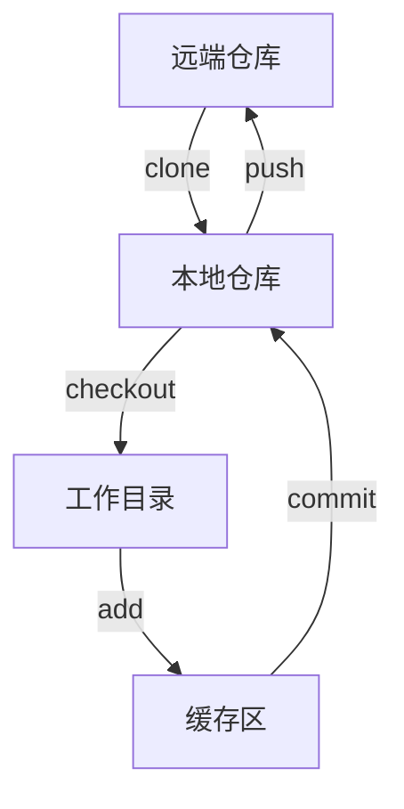

# Git使用笔记

## 什么是Git

​		Git是一个管理文件版本的工具，所有文件的修改、增删都会在这里保存，以便将来某一时刻进行查看或还原。

## Git常用命令

#### 创建仓库

- 克隆远端服务器的仓库：`git clone username@host:/path/to/repository`
- 初始化本地仓库：`git init`

#### 配置身份

1. `git config --global user.name "xx"`
2. `git config --global user.email "xxx.com"`

#### 更新代码

- 更新本地仓库：`git pull`，`git pull <远程库名> <远程分支名>:<本地分支名>`
- 合并其他分支到当前分支：`git merge <branch>`

​		<!--<branch>是分支名称-->

- 从本地仓库检出代码：`git checkout .`
- 从本地仓库检出指定文件夹或文件：`git checkout <path>/<filename>`

#### 提交代码

- 添加文件到缓存区：`git add <filename>`或 `git add .`

​		<!--<filename>是文件名称-->

- 检查缓存区是否有文件未提交：`git status`
- 检查本地文件和仓库文件差别：`git diff <filename>`
- 将缓存区文件提交到仓库：`git	commit -m 'info'`

​		<!--'info'是备注，提交后会显示在标题部分-->

- 将仓库文件提交到远端服务器：`git push origin <branch>`

#### 代码分支

- 创建并进入新的分支：`git checkout -b <branch>`

- 切换到已有分支：`git checkout <branch>`

  <!--(主分支名称是master)-->

- 删除分支：`git branch -d <branch>`

- 查看已有分支：`git branch -a`

- 是否与远程建立连接：`git remote -v`

- 与远程仓库加关联：`git remote add origin <远程库名>`

- 将本地分支推送到远端分支：`git push origin <本地分支名>:<远程分支名>`

#### 回退代码

- 查看历史修改记录：`git log`

- 查看指定文件的提交历史：`git log -p <filename>`

- 以列表形式查看文件提交历史：`git blame <filename>`

- 查看文件内容：`cat <filename>`

- 回退到上一个版本：`git reset --hard HEAD^`

- 获取历史版本号：`git reflog`

- 回退到指定版本：`git reset --hard 版本号`

  <!--版本号要加双引号""-->

#### 其他命令

- 查看GIT版本：`git --version`

## 关于repo

#### repo是什么

- 由Google开发的用于管理Android版本库的一个工具

- 是一个调用git的脚本
- 可以实现对多个git库的管理

#### repo和git的区别

- 假设一个很大的工程有很多个git库组成，那么使用`git clone`要输入很多次，而使用`repo sync`则只需要输入一次即可

#### repo常用命令

- 初始化：`repo init -u <URL>`

  <!--在当前目录下安装repo，会产生一个.repo目录，目录包括repo源代码和标准 Android 清单文件的 Git 仓库-->

- 同步：`repo sync [<PROJECT_LIST>]`

  <!--将远程代码下载到本地，如果省略`[<PROJECT_LIST>]`，则会按照标准 Android 清单文件依次从各个git仓库下载所有代码-->

- 创建并切换新分支：`repo start <branchname>`

- 切换分支：`repo checkout <branchname> `

- 查看分支：`repo branches`

- 查看本地文件和仓库文件差异：`repo diff`

- 查看文件状态：`repo status`

- 上传：`repo upload [<PROJECT_LIST>]`

  <!--上传到代码审核服务器（比如gitter），以便代码审核者进行review-->

- 从代码审核服务器下载代码：`repo download`

- 查看repo版本：`repo version`

- 更新repo：`repo selfupdate`

