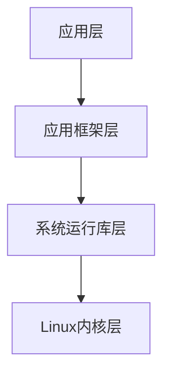
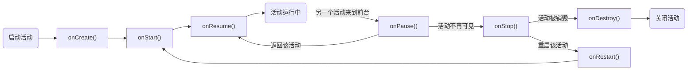
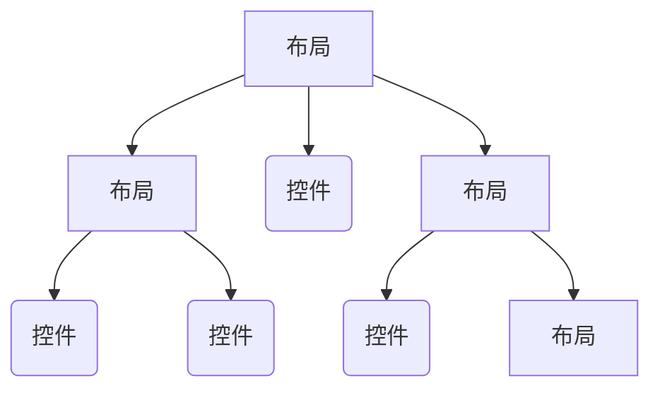

# 一、Android简介

### Android系统架构



##### Linux内核层

- 基于Linux内核，为各种硬件提供底层驱动

##### 系统运行库层

- 通过一些c/c++库来为Android系统提供主要的特性支持

- 提供一些核心库，用来允许开发者使用Java语言来编写Android应用
- 包含ART运行环境（相当于移动端的Java虚拟机）

##### 应用框架层

- 提供构建应用程序时可能遇到的各种API

##### 应用层

- 各种应用程序

### Android应用开发

1. 四大组件（Activity、Service、Broadcast receiver、Content Provider）
2. 系统控件（textView、button、switch ……）
3. SQLite数据库（Android自带轻量级数据库，可以通过Android封装好的API进行操作）
4. 多媒体
5. 地理位置定位

### 开发环境

- JDK
- SDK
- Android Studio
- Android模拟器

### HELLOWORLD

### 日志工具Log

1. log.v() --- verbose所有日志信息

2. log.d() --- debug 调试信息

3. log.i() --- info 比较重要的信息

4. log.w() --- warn 潜在风险

5. log.e() --- error 已出现的错误

   <!--Log与System.out的区别：Log有打印时间、可以添加过滤器、有分级等等；所以忘掉System.out！！-->


# 二、Activity 活动

### Activity是什么

- 是一种可以包含用户界面的组件，主要用于和用户进行交互
- 一个应用程序中可以包含一个或多个Activity

### 创建和注册

- New-->Activity-->Empty Activity
- 在AndroidManifest中进行注册

### Toast

Toast.makeText();

### MENU

1. 在res目录下创建menu文件夹及文件
2. 添加menu内容
3. 在Activity中重写onCreateOptionsMenu()创建菜单
4. 重写onOptionsItemSelected()定义菜单响应事件

### 销毁活动

- finish（）

### Intent

- Intent是Android程序中各组件之间进行交互的一种方式，不仅可以指明当前组件想要执行的动作，还可以在不同组件之间传递数据。

- 显示Intent：

  - `Intent(Context packageContext,class<?> cls)`

- 隐式Intene：

  - 在AndroidManifest里配置<intent-filter>键值对

    ```Java
    <intent-filter>
        <action android:name = "com.example.activitytest.ACTION_START"/>
        <category android:name = "android.intent.category.DEFAULT"/>
    <intent-filter>
    ```

  - `Intent intent = new Intent("com.example.activitytest.ACTION_START")`

  - `intent.addCategory("android.intent.category.DEFAULT")`

- 向下一个活动传递数据

  - `intent.putExtra("dataName",data)`
  - `intent.getStringExtra("dataName")`

- 返回数据给上一个活动

  - `startActivityForResult()`
  - `setResult(RESULT_OK,intent)`
  - `onActivityResult()`

### Activity的生命周期

- onCreate()
- onStart()
- onResume()
- onPause()
- onStop()
- onDestroy()
- onRestart()



### Activity的启动模式

- standard
- singleTop（栈顶复用）
- singleTask（栈内唯一）
- singleInstance(全局唯一)

<!--在AndroidManifest中配置 android:launchMode="xxx"即可-->

<!--当使用singleInstance时，由于存在两个栈，按back键会弹出当前栈中的Activity，当前栈为空后继续弹出另一个栈的Activity，所有栈都为空后退出程序。-->

### 最佳实践

1. 判断当前活动：

   ```Java
   //创建一个继承于AppCompatActivity的类，这个类没有对应的layout，也不需要在AndroidManifest中注册
   //在这个类的onCreate（）方法中打印一条日志：Log.d(TAG,getClass().getSimpleName())
   //让其他Activity都继承于这个类而不是AppCompatActivity，这样每次进入一个Activity都会打印当前Activity的名称。
   ```

2. 随时退出程序：

   ```java
   //创建一个管理Activity的类，这个类包含一个储存Activity的链表和对应的add、remove、finishAll方法
   //在每个Activity的onCreate()方法中调用这个类的add()方法，在onDestroy()方法中调用这个类的remove()方法
   //当要退出程序时，调用这个类的finishAll方法
   publish static viod finishAll(){
       for(Activity activity:activitys){
           if(!activity.isFinishing()){
               activity.finish();
           }
       }
   }
   ```

3. 启动活动的最佳写法：

   ```java
   //在每个Activity中加入一个actionStart方法，这个方法的参数包含所有启动本Activity所需的数据
   //在方法中构建Intent并调用startActivity()方法。
   public static void actionStart(Context context,String data1,String data2){
       Intent intent = new Intent(context,getClass());
       intent.putExtra("param1",data1);
       intent.putExtra("param2",data2);
       context.startActivity(intent);
   }
   ```

# 三、UI开发

### 控件

##### 常用属性

- 宽度：`layout_width`
- 高度：`layout_height`
- 对齐方式：`gravity`
- 文字：`text`
- 文字大小：`textSize`
- 文字颜色：`textColor`
- 背景：`background`
- ……

##### 常用控件

- TextView

- Button

  ```Java
  textAllCaps = "false"//阻止Button把所有字母转换成大写
  ```

- EditText

  ```Java
  hint = “xxx”//显示提示并在用户开始输入后消失
  maxLines = "2"//控制EditText的高度
  ```

- ImageView

  ```Java
  src = "@drawable/img_1"//图片资源
  ```

- ProgressBar

  ```Java
  style = "?android:attr/progressBarStyleHorizontal"//设置水平进度条（默认为圆形）
  progerssBar.setVisibility(View.VISIBLE);
  //设置控件是否可见；可见：View.VISIBLE，不可见但存在：View.INVISIBLE，消失：View.GONE
  ```

- AlertDialog

  ```Java
  //AlertDialog对话框制定与所有界面元素之上，且会屏蔽其他控件的交互能力。
  AlertDialog.Builder dialog = new AlertDialog.Builder(MainActivity.this);
  dialog.setTitle("title");//标题
  dialog.setMessage("message");//内容
  dialog.setCancelable(false);
  dialog.setPositiveButton("OK",new DialogInterface.onClickListener(){
      @Override
      public void onClick(){}
  });
  dialog.setNegativeButton("Cancle",new DialogInterface.onClickListener(){
      @Override
      public void onClick(){}
  });
  dialog.show();
  ```

- ProgressDialog

  ```java
  //出现一个能够屏蔽其他控件交互能力的进度条。
  ```

### 布局

##### 布局的嵌套



##### LinearLayout

- 排列方向：`android:orientation="vertical/horizontal"`
- 控件在布局中的对齐方式：`android:layout_gravity="top/bottom"`
- 用权重来指定控件大小：`android:layout_weight="1"`

##### RelativeLayout

- 相对布局可以先在布局中央摆放一个控件，剩余控件的摆放都要基于已存在的控件进行摆放。

##### FrameLayout

- 帧布局，后摆放的控件会压在前摆放的空间上面；有点像PS中的图层

##### PercentFrameLayout和PercentRelativeLayout

- 使相对布局和帧布局也可以使用`android:layout_weight`属性来指定控件大小

### 自定义控件

##### 引入布局

1. 新建布局文件title.xml
2. 在要引用的位置加入 `<include layout="@layout/title">`

```Java
//隐藏标题栏
ActionBar actionbar = getSupportActionBar();
if(actionbar != null){
    actionbar.hide();
}
```

##### 自定义控件

1. 新建TitleLayout继承自LinearLayout

2. 重写LinearLayout中带有两个参数的构造方法

   ```java
   public TiyleLayout(Context context,AttributeSet attrs){
       super(context,attrs);
       LayoutInflater.from(context).inflate(R.layout.title,this);
       //from()方法构建出一个LayoutInflate对象，再调用inflate()方法加载布局文件。
   }
   ```

3. 为自定义的控件创建响应方法

4. 在要添加控件的XML文件中直接添加，注意要是用全包名

### ListView

##### ListView的创建

1. 定制ListView中每个item的布局
2. 指定一个xxxAdapter类继承ArrayAdapter<>类，重写getView()方法
3. 实例化xxxAdapter类，将这个对象当做参数传给listView.setAdapter中
4. 优化①：在getView()中加入判断，如果convertView为空，则加载布局，不为空则直接将convertView赋给view，避免重复加载布局
5. 优化②：新建xxxAdapter的内部类ViewHolder来管理布局中的控件，在加载布局时获取控件实例并用view.setTag()来储存，在将convertView赋值给view时调用view.getTag来重新获取控件。

##### ListView的点击事件

- 使用setOnItemClickListener()方法为ListView注册监听器，重写onItemClick()方法来设置点击的响应事件，onItemClick()方法的参数position表示点击的是第几项（从0开始）

### RecycleView

- ze增强版的ListView，优化了ListView的各种不足

##### 基本用法

1. 在布局中加入RecycleView控件

2. 为RecycleView中的item项设置相应的布局

3. 创建一个适配器

   - 新建XxxAdapter类，让这个适配器继承自RecyclerView.Adapter，泛型指定为XxxAdapter.ViewHolder
   - 定义一个内部类ViewHolder，继承自RecyclerView.ViewHolder，在这里获取布局中的控件
   - 定义XxxAdapter类的构造函数，参数为要展示的链表，并将这个链表赋值给全局变量
   - 重写onCreateViewHolder方法，加载item布局；然后创建ViewHolder实例并返回
   - 重写onBindViewFolder方法，对RecycleView子项的数据进行复制
   - 重写getItemCount方法，用于告诉RecycleView共有多少子项

4. 创建RecycleView

   - 获取RecycleView

   - 给recycleView设置LayoutManager

     ```Java
     LinearLayoutManager layoutManager = new LinearLayoutManager(this);
     recycleView.setLayoutManager(layoutManager);
     ```

   - 给recycleView设置adapter

##### 横向滚动

- 把item布局设置为垂直排列

- 在给recycle设置recycleView设置LayoutManager时加入

  ```java
  LinearLayoutManager layoutManager = new LinearLayoutManager(this);
  layoutManager.setOrientation(LinearLayoutManager.HORIZONTAL);
  recycleView.setLayoutManager(layoutManager);
  ```

##### 瀑布流布局

- 更改item布局

- 给recycleView设置LayoutManager

  ```Java
  StaggeredGridLayoutManager layoutManager = new StaggeredGridLayoutManager(3,StaggeredGridLayoutManager.VERTICAL);
  recycleView.setLayoutManager(layoutManager);
  ```

##### 点击事件

- RecycleView需要在子项中设置点击事件，也即在item布局中设置点击响应事件

##### 注意事项：

1. 在设置item项的布局时，要把整个布局的`layout_width`和`layout_height`属性做相应更改
2. 想在每个项之间加入分割线或者设置间距可以通过在item中增加控件完成

# 四、Fragment 碎片

### 什么是Fragment

- 一种可以嵌入在活动中的UI片段
- 能让大屏幕的空间被应用地更加合理和充分

### Fragment的使用方式

##### 简单用法

1. 创建Fragment布局
2. 创建Fragment布局对应的类，继承自Fragment，并重写onCreateView方法
3. 在需要放置碎片的xml文件中加入`<fragment>`并指定name<!--包名+类名-->
4. 获取Fragment

##### 动态添加碎片

1. 创建并获取Fragment
2. 在需要放置Fragment的位置与预留出一个布局用来盛放Fragment
3. 获取FragmentManager<!--在活动中可以直接调用getSupportFragmentManager()方法获取-->
4. 通过FragmentManager的`beginTransaction()`来开启一个事务
5. 调用事务的`replace()`方法来替换Fragment
6. 提交事务`commit()`

##### 模拟返回栈

- 在提交事务之前先`addToBackStack(null)`

##### Fragment与Activity之间的通信

- 从布局文件中获取碎片：`getFragmentManager().findFragmentById(R.id.Xxx)`
- 在碎片中获取当前活动：`getActivity()`

### 碎片的生命周期

### 常见限定符

##### 屏幕大小

- small
- normal
- large
- xlarge

##### 分辨率

- ldpi
- mdpi
- hdpi
- xhdpi
- xxhdpi

##### 方向

- land
- prot

##### 最小宽度限定符

- sw600dp
- 计算方式：
  1. 需要了解手机屏幕的像素和dpi，比如像素是1080 X 2280，dpi是320
  2. 用手机dpi320除以一个android规定的值160，等于2；
  3. 再用手机宽度像素1080除以生面计算得到的2，等于540dp
  4. 只有当sw小于这个值的适配才能用到这个屏幕上，比如sw600dp就适配不了，sw500dp能适配

# 五、Broadcast Receiver广播

### 广播分类

- 标准广播（Normal broadcasts）

  <!--一种完全异步执行的广播，广播接收者之间没有先后顺序，也无法被截断-->

- 有序广播（Ordered broadcasts）

  <!--一种同步执行的广播，广播发出后同一时间只会有一个接收者能够接受这条消息，当这个接收者的逻辑执行完毕后广播才会继续传递；优先极高的接受者可以截断或修改正在传递的广播-->

### 接受广播

- 动态注册
  1. 新建一个接收器类继承自BroadcastReciever并重写onReceive()方法
  2. 新建IntentFilter()对象，添加Action：`intentFilter.addAction("android.net.conn.CONNECTIVITY_CHANGE")`
  3. 创建接收器对象，注册广播接受者：`registerReceiver(networkChangeReceiver,intentFilter)`
  4. 在onDestroy生命周期销毁广播接收者：`unregisterReciver(networkChangeReceiver)`
- 静态注册
  1. 使用Android Studio提供的快捷方式创建广播接收器
  2. Manifest中会有`<receiver>`标签，在其中添加`<intent-filter>`来指明action

### 发送广播

- 标准广播

  ```java
  Intent intent = new Intent("com.example.broadcasttest.XXX");
  intent.setPackage("xxx.xxx");
  sendBroadcast(intent);
  ```

- 有序广播

  1. `sendOrderedBroadcast(intent,null);`
  2. 在静态注册的Manifest文件的`<intent-filter>`中加入 `android:priority="100"`
  3. 在onReceive()方法中调用abortBroadcast()方法，表示截断广播

### 本地广播

- 本地广播发送的广播只能在应用程序的内部传递，且广播接收器也只能接收来自本应用程序的广播

##### 使用方法

1. 获取本地广播管理器的实例：`LocalBroadcastManager.getInstance(this)`
2. 注册本地广播监听器：`localBroadcastManager.registerReciever()`
3. 新建一个接收器类继承自BroadcastReciever并重写onReceive方法
4. 发送广播:`sendBroadcast`

# 六、持久化技术

### 持久化技术简介

- 持久化技术是指将那些保存在内存中瞬时数据保存到储存设备中，保证即使手机或电脑关机的情况下，这些数据仍然不会丢失。
- Android中常见的持久化技术有文件存储、SharedPreference存储以及数据库存储

### 文件存储

- 会将数据原封不动的存储在文件中，适合用来存储简单数据或者二进制数据

##### 使用方法

1. 创建文件流：`openFileOutput("fileName",Context.MODE_PRIVATE)`
2. 创建字符流：`new BufferedWriter(new OutputStreamWrite(out))`
3. 读写数据：`write.write(data)`
4. 在onDestroy中存储数据并关闭流

- 文件存储地址：`/data/data/com.example.filepersistencetest/files/<fileName>`

- 从文件中读取数据时创建输入流并读取文件数据即可

  <!--使用`TextUtils.isEmpty(String string)`可以同时判断字符串等于null或为空字符串-->

### SharedPreferences存储

- SharedPreferences存储是使用键值对的方式来存储数据的，支持多种不同的数据类型存储。

##### 使用方法

1. 获取SharedPreferences对象
   - Context类中的getSharedPreferences()方法
   - Activity类中的getPreferences()方法
   - PreferenceManager类中的getDefaultSharedPreferences()方法
2. 获取SharedPreferences.Editor对象：`sharedPreferences.edit()`
3. 向SharedPreferences.Editor对象添加数据：`editor.putString(key,value)`
4. 提交数据：`editor.apply()`

###### 从SharedPreferences中读取数据

- 获取SharedPreferences对象后调用getxxx方法：`pref.getString`

### SQLite数据库存储

- Android的内置数据库，是一种轻量级的关系型数据库，支持标准的SQ语法和ACID事务。

##### SQLiteOpenHelper基本用法

1. 新建类继承SQLiteOpenHelper
2. 重写构造方法，第二个参数为数据库名
3. 重写onCreate()方法，在这里建数据表
4. 在其他类中获取实例，调用getWritableDatabase()或者getReadableDatabase()方法来获取数据库实例
5. 重写onUpgrade()方法来升级数据库

- 向数据表中增加数据调用数据库的实例的insert()方法
- 向数据表中修改数据调用数据库的实例的update()方法
- 从数据表中删除数据调用数据库的实例的delete()方法
- 从数据表中查询数据调用数据库的实例的query()方法

##### LitePal基本用法

- 配置LitePal

# 七、Content Provider内容提供器

### 运行时权限与权限组的概念

### 系统自带的Content Provider

##### 基本用法

1. 获取ContentResolver实例：`Context.getContentResolver()`

2. 调用该实例的insert，update，delete，query方法对数据库进行增删改查

3. 需要使用的URI格式：`content://com.example.app.provider/table1`

   <!--表示使用content协议，加应用程序包名，加表名；也可以再加一个数值，表示期望访问的数据id-->

   <!--URI也支持通配符，*表示任意长度的任意字符，#表示任意长度的数字-->

### 自定义Content Provider

##### 基本用法

1. 新建类继承ContentProvider类并重写它的六个方法
2. 在Manifest中添加`<provider>`对来注册内容提供器
3. 在需要访问内容提供器的地方先使用Uri.parse来解析Uri，再进行增删改查的操作

# 八、手机多媒体

### Notification

##### 使用步骤

1. 创建NotificationManager来对通知进行管理：`(NotificationManager)getSystemService(Context.NOTIFICATION_SERVICE)`

2. 使用Builder构造器来创建Notification对象：

   ```Java
   new NotificationCompat.Builder(context)
       .setContentTitle("xxx")//
       .setContextText("xxx")
       .setWhen(System.currentTimeMillis())
       .build();
   ```

3. 调用Manager的notify()方法让通知显示出来

4. 使点击通知后跳转到指定界面：

   - 创建一个intent`Intent(this,NotificationActivity.class)`
   - 用这个intent创建一个PendingIntent：`PendingIntent.getActivity(this,0,intent,0)`
   - 给创建Notification时追加一个 `setContentIntent(pi)`

5. 使点击通知后通知消失

   - 给创建Notification时追加一个 `setAutoCancel(true)`
   - 或者掉用NotificationManager对象的cancle()方法

6. 通知设置声音

   - 给创建Notification时追加一个 `setSound(Uri.fromFile(new File("xx/xxx/x.ogg")))`

7. 通知设置震动

   - 给创建Notification时追加一个 `setVibrate(new long[]{0,1000,1000,1000})`
   - 在Manifest中声明权限

8. 显示更加丰富的通知内容：setStyle

9. 设置通知的重要程度：setPriority

### 摄像头和相册

### 播放多媒体文件

# 九、网络

# 十、Service服务

### 服务是什么

- 是Android中实现程序后台运行的解决方案
- 不依赖于用户界面
- 依赖于创建服务时所在的应用程序进程
- 不会自动开启线程，默认运行在主线程当中

### Android多线程编程

##### 基本用法

- 继承Thrend类/实现Runable接口

##### 异步消息处理机制

- ###### Message

  - 在线程之间传递的消息，可以携带少量信息
  - 可以使用what、arg1、arg2字段携带整型数据
  - 可以使用obj字段携带一个Object对象

- ###### Handler

  - 用于发送和处理消息
  - 用sendMessage()方法发送消息，传递到handleMessage()方法中

- ###### MessageQueue

  - 消息队列，存放所有通过Hadler发送的消息
  - 每个线程只有一个MessageQueue

- ###### Looper

  - MessageQueue的管家，每当发现MessageQueue中存在一条新的消息，就会将它取出并传递到handleMessage()方法中

##### AsyncTask

### 服务的基本用法

1. ##### 定义一个服务

   - 新建类继承自Service类
   - 在Manifest文件中配置<`service`>注册服务

2. ##### 启动和停止服务

   - 新建Intent，调用startService(intent)来启动服务
   - 新建Intent，调用stopService(intent)来停止服务
   - 在服务内调用stopSelf()也可以停止服务

3. ##### Service和Activity的通信

   - 在服务类中新建一个继承自Binder的内部类，并提供需要调用的方法
   - 创建这个内部类的对象，并在onBind方法案中返回这个对象
   - 在Activity中创建ServiceConnection的对象，并重写onServiceConnected和onServiceDisonnected方法，在onServiceConnected方法中将参数service向下转型为内部类的实例并返回
   - 调用bindService()方法把活动和服务绑定起来，传参为intent、内部类的实例

### 服务的生命周期

- onCreate() ==> onStartCommand() ==> onBind() ==> onDestroy()

### 服务的更多技巧

##### 前台服务

- 使用Builder构造器来创建Notification对象：

  ```Java
  new NotificationCompat.Builder(context)
      .setContentTitle("xxx")//
      .setContextText("xxx")
      .setWhen(System.currentTimeMillis())
      .build();
  ```

- 调用startForeground()方法将服务显示出来

##### IntentService

- 一个异步的、会自动停止的服务
- 基本用法
  1. 新建类继承IntentService
  2. 在activity中用Intent来启用startService()
  3. 在AndroidManifest中注册

# 十一、基于位置的服务

### 基于位置的服务简介

- 简称LBS，Goole内置的API有GPS定位和网络定位两种；但在国内一般使用第三方公司的SDK，比如百度、高德

- 以下为使用百度SDK的内容

### 申请API key

1. 申请百度账号并申请成员为一名百度开发者
2. 下载SDK

### 使用百度定位

# 十二、Material Design

# 十三、其他Android开发技巧

### 全局获取Context

- 用自定义的MyApplication类代替系统自带Application类，在这个类中提供生成并返回Context实体的方法

##### 具体步骤

1. 新建MyApplication类继承Application类，在onCreate()方法中用`getApplicationContext()`获取Context实例
2. MyApplication类中提供getContext()方法返回Context实例
3. 在AndroidManifest中将Application标签中的name属性改为`xxx.MyApplication`
4. 在需要用到Context实例的时候调用`MyApplication.getContext()`

### 使用Intent传递对象

- intent.putExtra()方法中支持大多数常用数据类型，但对自定义对象当然是不支持的

##### 解决方案

- ###### Serializable序列化

  1. 让自定义类实现Serializable接口
  2. 使用putExtra()直接传输
  3. 在接收后强转为自定义类的类型

- ###### Parcelable分解对象

  1. 让自定义类实现Parcelable接口
  2. 重写describeContexts()方法
  3. 重写writeToParcel()方法，对所有字段一一写出，比如：`dest.writeString(name)`
  4. 提供一个CREATOR的常量，
  5. 其他使用步骤和Serializable相同

### 定制自己的日志工具

- 新建LogUtil类，在其中定义VERBOSE、DEBUG、INFO、WARN、ERROR、NOTHING六个常量，分别对应123456

- 提供v()、d()、i()、w()、e()五个方法，每个方法中对级别和等级常量进行比较，在满足条件时调用相应的 `Log.e()`等方法

  ```java
  public class LogUtil {
      public static final int VERBOSE = 1;
      public static final int DEBUG = 2;
      public static final int INFO = 3;
      public static final int WARN = 4;
      public static final int ERROR = 5;
      public static final int NOTHING = 6;
      public static int level = VERBOSE;
  
      public static void v(String tag,String msg){
          if (level <= DEBUG){
              Log.v(tag,msg);
          }
      }
  
      public static void d(String tag,String msg){
          if (level <= DEBUG){
              Log.d(tag,msg);
          }
      }
  
      public static void i(String tag,String msg){
          if (level <= INFO){
              Log.i(tag,msg);
          }
      }
  
      public static void w(String tag,String msg){
          if (level <= WARN){
              Log.w(tag,msg);
          }
      }
  
      public static void e(String tag,String msg){
          if (level <= ERROR){
              Log.e(tag,msg);
          }
      }
  }
  ```

- 在打印日志时调用`LogUtil.d()`等方法来打印

- 在需要打印某个级别以上的日志或者不打印日志时，改变lexel的值即可

### 调试Android程序

- 断点
- 单步

### 创建定时任务

##### Alarm机制

##### Doze模式

##### 多窗口模式

