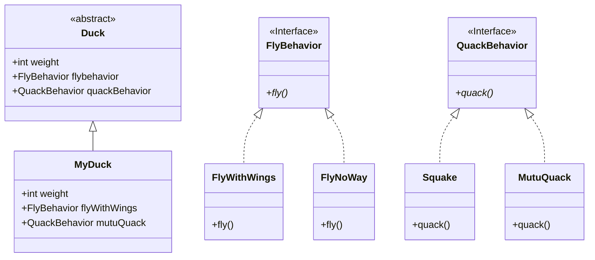
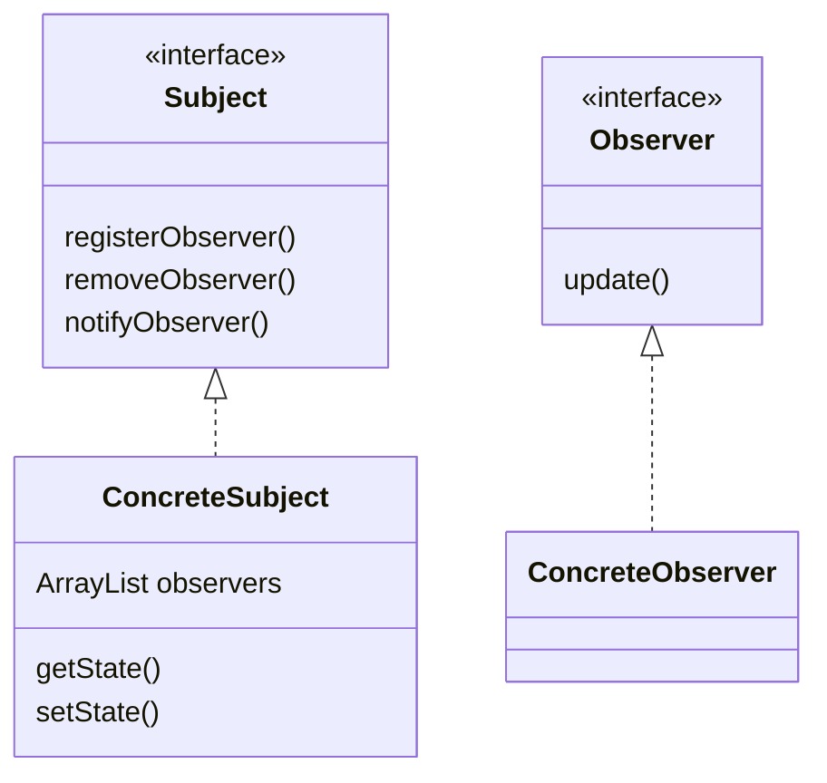
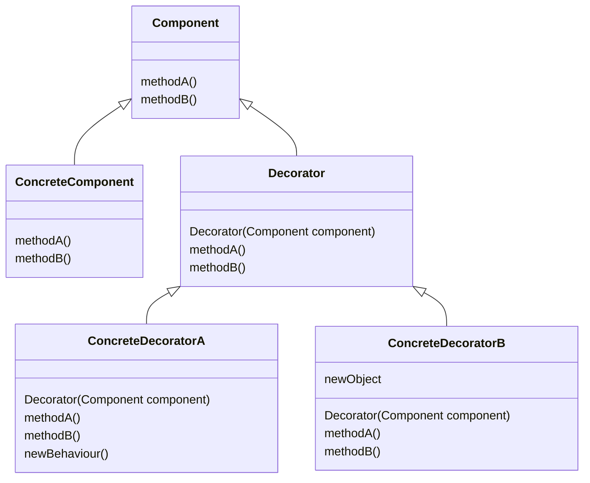
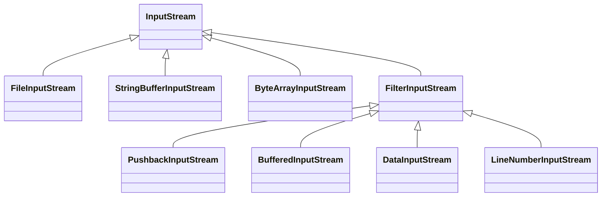
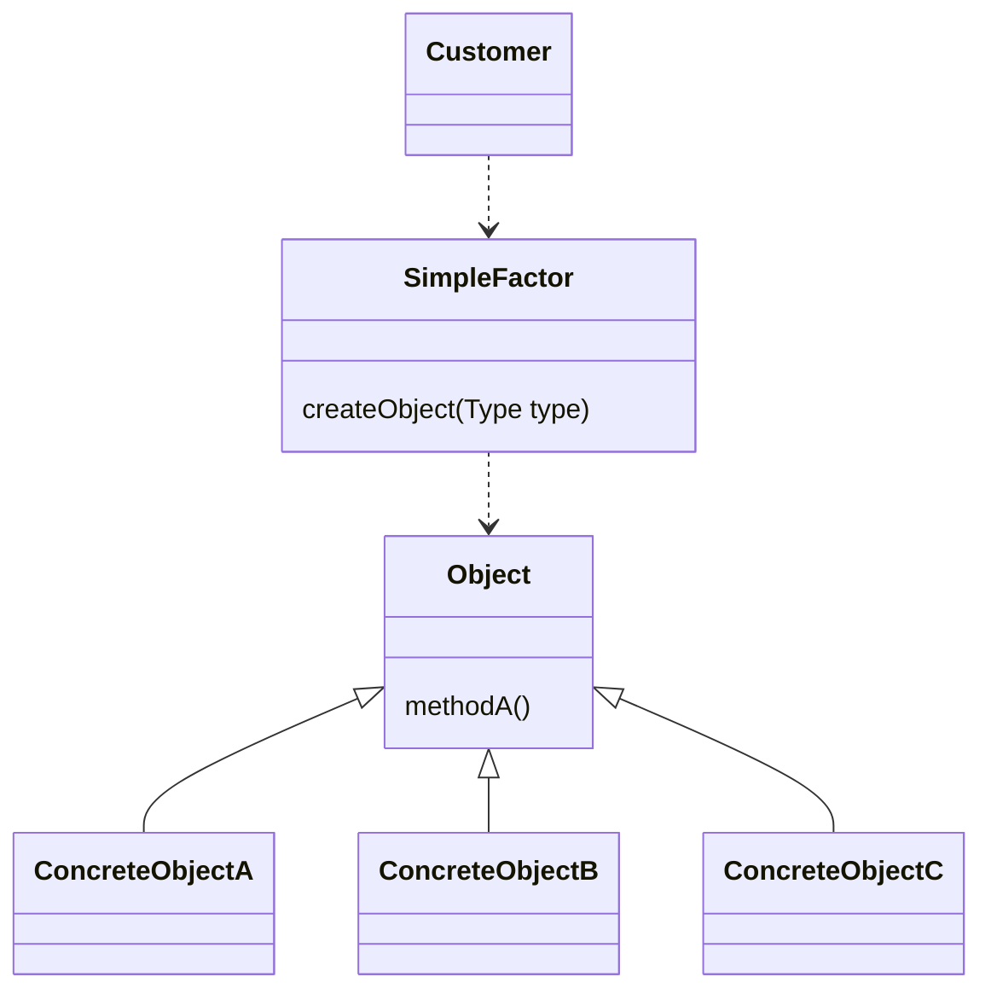
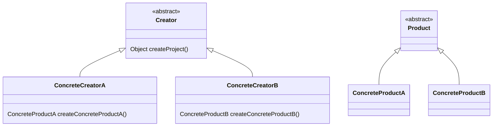
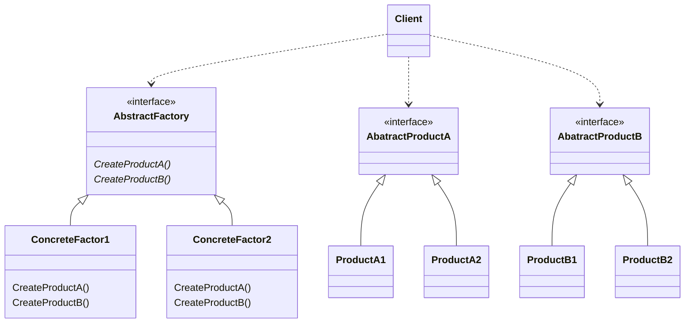

# 设计模式入门

## 代码复用

- 相同的代码只写一次

## 设计原则1：

**找出应用中可能需要变化的地方，把他们独立出来，不要和那些不需要的代码放在一起**

- 把会变化的部分取出来并“封装”起来，好让其他部分不会受到影响
- 保证在扩展时不需要改动已经存在的代码

## 设计原则2：

**针对接口编程，而不是针对实现编程**

- 针对接口编程是指 针对超类型（supertype）编程


## Duck示例



# 观察者模式

**观察者模式定义了对象之间的一对多的依赖，当一个对象改变状态时，它的所有依赖者都会收到通知并自动更新**

- 观察者模式包括两部分：观察者和主题
- 主题的状态发生改变时，会通知观察者
- 观察者可以决定是否要被通知以及哪一部分发生改变时才要被通知
- 观察者可以动态的进行注册和注销



## 设计原则3：

**使用松耦合**

- 松耦合是指两个对象之间可以进行交互，但不需要了解彼此的细节
- 比如当ConcreteSubject的状态发生改变时，只需要调用observers中每个对象的update方法即可完成通知，但ConcreteSubject并不清除每个ConcreteObserver的具体内容。

## Java内置的观察者模式

**Java.uitl包下内置了Observable类和Observer接口**

- Observable类是主题的超类，且实现了注册、移除和通知三种方法，因此当创建被观察者继承Observable类是不需要再重写这些方法。

- Observer接口是观察者的接口

- 观察者需要向主题注册时，需要这样操作：

  ```java
  public CurrentConditionsDisplay(Observable observable) {
  	this.observable = observable;
  	observable.addObserver(this);
  }
  ```

### 推与拉

**“推”是指每当主题的内容发生变化时，主题会主动通知观察者这种变化；而“拉”是指当观察者需要获悉某种状态时，可以主动调用而不是被动等待通知**

- “推”的时候需要在观察者内写好update()方法而在主题内调用
- “拉”的时候需要在主题内定义一系列getter()方法而在观察者内调用

### java.util.Observable的不足

**Observable是一个类而不是接口**

## 设计原则4：

**多用组合，少用继承**

- java不支持多继承，使用继承不利于代码以后的扩展
- 使用组合依然可以获得指定对象的全部信息
- 使用组合可以在多态的情况下动态的增减对象


# 装饰者模式

**动态的将责任附加到对象上。装饰者模式提供有别于集成的另一种方式来实现功能的扩展**

## 结构简述

- 装饰者和被装饰者有相同的超类型
- 可以用一个或者多个装饰者装饰一个被装饰者
- 可以用装饰过的被装饰者来代替被装饰者
- 装饰者可以在所委托被装饰者的行为之前/之后，加上自己的行为



## 设计原则5：

**类应该对扩展开放，对修改关闭**

- 使用组合等方式使类可以在需要时承担新的功能，但是不必改变原来的代码
- 不需要将每一部分代码都设计成遵循开闭原则的，因为这通常会引入新的抽象层次，增加代码复杂度；将最有可能改变的地方设计为遵循开闭原则即可

## 实例：Java.io包

- InputStream下的装饰者与被装饰者



## 装饰者模式的优缺点

### 优点

- 可以为设计注入弹性
- 可以维持开放-关闭原则

### 缺点

- 可能会在设计时加入大量的细小的类
- 在使用装饰者组件进行实例化时，可能要进行多次包装和实例化


# 工厂模式

**使用工厂来处理创建对象的细节**

## 简单工厂模式

- 简单工厂更像一种编程习惯而不是设计模式，它通过统一的工厂创建具体对象
- 当需要某个对象时，调用简单工厂的对象创建方法来获得具体对象



## 工厂方法模式

**工厂方法模式定义了一个创建对象的接口，但由子类决定要实例化的类是哪一个。工厂方法让类把实例化推迟到子类**

- 建立客户对象的抽象超类，并把抽象的对象创建方法放在这里
- 具体的客户对象继承自这个抽象超类，并重写对象创建方法
- 这里的妙处在于：抽象超类中并没有不知道如何具体创建对象，但是已经可以对创建出来的对象做处理了；也就是说：**工厂方法将客户从具体类型中解耦了**。



## 设计原则6：

**依赖倒置原则**

- 不能让高层组件依赖底层组件
- 不管该层或者底层组件，都应该依赖于抽象

### 具体做法：

1. 变量不可以持有具体类的引用
2. 不要让类派生自具体类
3. 不要覆盖基类中已经实现的方法

## 抽象工厂

**抽象工厂模式提供一个接口，用于创建相关或依赖对象的家族，而不需要明确指定具体类**

- 抽象工厂的作用也是**把客户从使用的具体类型中解耦**



**注意**：抽象工厂的方法经常以工厂方法的方式实现；抽象工厂的任务是定义一个负责创建一组产品的接口，这个接口内的每个方法都负责创建一个具体产品，同时利用实现抽象工厂的子类来提供这些具体的做法。

### 抽象工厂和工厂方法的区别：

抽象工厂可以用来创建一系列产品对象，而工厂方法可以将客户代码和使用的具体类型中解耦。


# 单例模式
