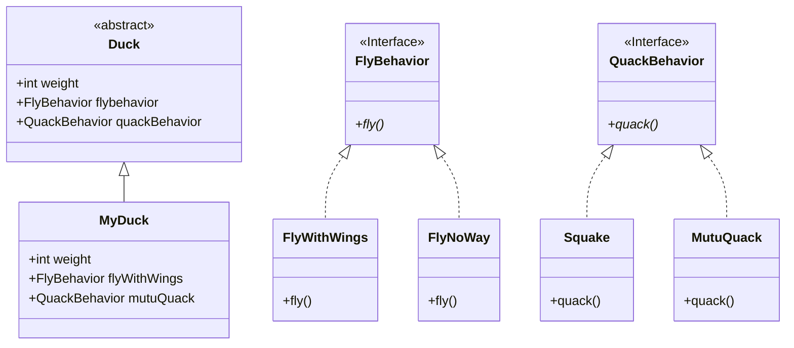
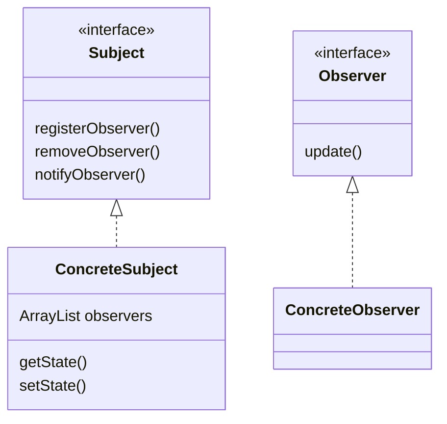

# 设计模式入门

## 代码复用

- 相同的代码只写一次

## 设计原则1：

**找出应用中可能需要变化的地方，把他们独立出来，不要和那些不需要的代码放在一起**

- 把会变化的部分取出来并“封装”起来，好让其他部分不会受到影响
- 保证在扩展时不需要改动已经存在的代码

## 设计原则2：

**针对接口编程，而不是针对实现编程**

- 针对接口编程是指 针对超类型（supertype）编程

## Duck示例

# 观察者模式

**观察者模式定义了对象之间的一对多的依赖，当一个对象改变状态时，它的所有依赖者都会收到通知并自动更新**

- 观察者模式包括两部分：观察者和主题
- 主题的状态发生改变时，会通知观察者
- 观察者可以决定是否要被通知以及哪一部分发生改变时才要被通知
- 观察者可以动态的进行注册和注销

## 设计原则3：

**使用松耦合**

- 松耦合是指两个对象之间可以进行交互，但不需要了解彼此的细节
- 比如当ConcreteSubject的状态发生改变时，只需要调用observers中每个对象的update方法即可完成通知，但ConcreteSubject并不清除每个ConcreteObserver的具体内容。

## Java内置的观察者模式

Java.uitl包下内置了Observable类和Observer接口

#### 推与拉
