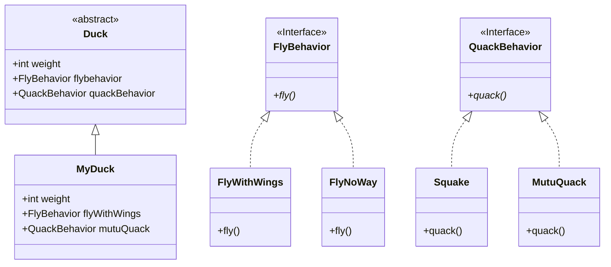

# 设计模式入门

### 代码复用

- 相同的代码只写一次

## 设计原则1：

- 找出应用中可能需要变化的地方，把他们独立出来，不要和那些不需要的代码放在一起
- 把会变化的部分取出来并“封装”起来，好让其他部分不会受到影响
- 保证在扩展时不需要改动已经存在的代码

## 设计原则2：

- 针对接口编程，而不是针对实现编程
- 针对接口编程是指 针对超类型（supertype）编程

### Duck示例

# 观察者模式

