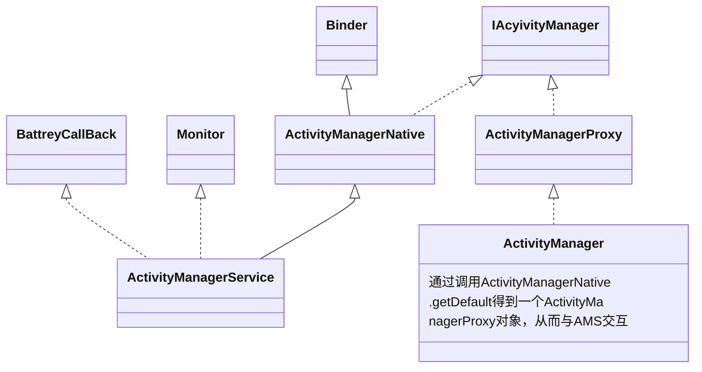

# 深入理解ActivityManagerService

## AMS大家族：

```mermaid
classDiagram
      BattreyCallBack <|.. ActivityManagerService
      Monitor <|.. ActivityManagerService
      ActivityManagerNative <|-- ActivityManagerService
      
      Binder <|--ActivityManagerNative
      IAcyivityManager <|..ActivityManagerNative
      
      IAcyivityManager <|..ActivityManagerProxy
      ActivityManagerProxy <|..ActivityManager
      
      class ActivityManager{
      	通过调用ActivityManagerNative
      	.getDefault得到一个ActivityMa
      	nagerProxy对象，从而与AMS交互
      }
```

## ActivityManagerService的main函数

- main函数将返回一个Context类型的对象
- 通过这个对象，可以获取AMS的资源、Java类信息等

